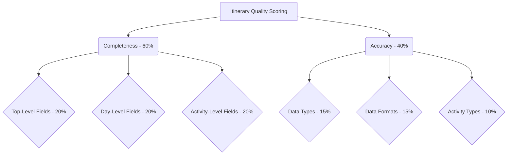

# Itinerary Analysis Plan

## Objective

Analyze all JSON files within the "doc/itineraires/json" directory to assess itinerary quality, focusing on data completeness and information accuracy. Identify the single "best" itinerary based on this scoring system and provide a comprehensive justification for its selection.

## Scoring Criteria

The scoring criteria will be based on data completeness and accuracy, with the following weights:

*   **Completeness (60%)**
    *   Top-Level Fields (20%)
    *   Day-Level Fields (20%)
    *   Activity-Level Fields (20%)
*   **Accuracy (40%)**
    *   Data Types (15%)
    *   Data Formats (15%)
    *   Activity Types (10%)

Here's a Mermaid diagram to visualize the scoring criteria:



## Analysis Steps

1.  **Information Gathering:**
    *   List files in `doc/itineraires/json` to get a list of all JSON files.
    *   Read the content of each JSON file.
    *   Read the content of `doc/itineraires/itineraries/standardized_schema.json` to understand the expected data structure and fields.

2.  **Analyze and Score Itineraries:**
    *   For each itinerary:
        *   Parse the JSON content.
        *   Evaluate the itinerary against the scoring criteria.
        *   Calculate a total score for the itinerary.
    *   Keep track of any data gaps or inconsistencies encountered.

3.  **Identify the Best Itinerary:**
    *   Compare the scores of all itineraries.
    *   Select the itinerary with the highest score as the "best".

4.  **Justify the Selection:**
    *   Provide a comprehensive justification for the selection, including:
        *   The specific, quantifiable data points extracted from the JSON files that demonstrate its superiority.
        *   How each data point contributes to the final score.
        *   A discussion of any data gaps or inconsistencies encountered and their potential impact on the final ranking.

## Workflow Diagram

```mermaid
graph TD
    A[Analyze Itineraries] --> B{List JSON Files};
    B --> C[Read JSON Files];
    C --> D[Read Schema];
    D --> E{Define Scoring Criteria};
    E --> F{Score Itineraries};
    F --> G{Identify Best Itinerary};
    G --> H[Justify Selection];